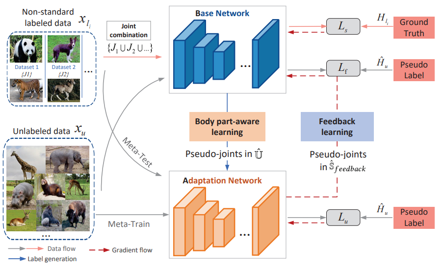
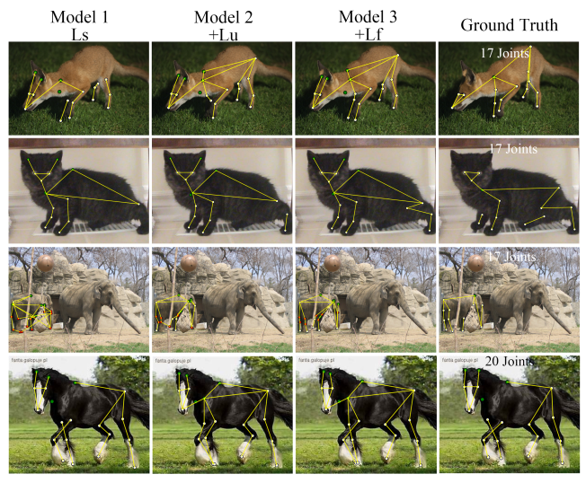

# Towards Labeling-free Fine-grained Animal Pose Estimation(ACM MM'24)

This project is the implementation of our proposed method **FreeNet**. The supplementary materials of our proposed Meta-cskt are available at: freenet/resources/FreeNet_supplementary.pdf

## Abstract
 In this paper, we are interested in identifying denser and finer animals joints. The lack of standardized joint definitions across various APE datasets, e.g., AnimalPose with 20 joints, AP-10k with 17 joints, and TigDog with 19 joints, presents a significant challenge yet offers an opportunity to fully utilize annotation data. This paper challenges this new non-standardized annotation problem, aiming to learn fine-grained (e.g., 24 or more joints) pose estimators in datasets that lack complete annotations. To combat the unannotated joints, we propose FreeNet, comprising a base network and an adaptation network connected through a circuit feedback learning paradigm. FreeNet enhances the adaptation network's tolerance to unannotated joints via body part-aware learning, optimizing the sampling frequency of joints based on joint detection difficulty, and improves the base network's predictions for unannotated joints using feedback learning. This leverages the cognitive differences of the adaptation network between non-standardized labeled and large-scale unlabeled data. Experimental results on three non-standard datasets demonstrate the effectiveness of our method for fine-grained APE.

## Idea


We observe shared joints in different animal body parts exhibit different learning difficulties due to dataset gaps and considerable species variation. This accuracy difference between head joints and back body joints is close to 10%. Moreover, due to lacking full annotated data, the unshared joints across different datasets have the smallest average number and the worst accuracy, aggravating the skewed joint distribution in the combined training data.



To combat the unannotated joints, we chose bi-model training to leverage the different abilities of the two models in complementary ways. Specifically, we propose FreeNet, which consists of a base network and an adaptation network, aiming at fine-grained APE with free full annotation labels.

## Datasets

### AP-10K

AP-10K dataset is provided [here](https://github.com/AlexTheBad/AP-10K).

### AnimalPose Dataset

AnimalPose dataset could be downloaded through the [official website.](https://github.com/noahcao/animal-pose-dataset)We randomly split the dataset by train:val = 9:1 for every category.

### TigDog dataset

TigDog dataset could be downloaded [here](http://calvin-vision.net/datasets/tigdog/)

## Dataset Preparation

The coco-formated annotations of AnimalPose, TigDog and combined dataset are at freenet/resources/annotation_files. 

Then arrange your dataset directory as follows:

```
- Dataset
  - ap_10k
    - annotations
    - data
      - 1.jpg
      - 2.jpg
      - ...
  - animal_pose
    - annotations
    - data
      - 1.jpg
      - 2.jpg
      - ...
  - tigdog
    - annotations
    - data
      - horse
        - 1.jpg
        - 2.jpg
        - ...
      - tiger
        - 1.jpg
        - 2.jpg
        - ...
	- ap10k_animalpose
		- annotations
        - data
          - 1.jpg
          - 2.jpg
          - ...
    - ap10k_animalpose_tigdog
		- annotations
        - data
          - 1.jpg
          - 2.jpg
          - ...
          - horse
            - 1.jpg
            - 2.jpg
            - ...
          - tiger
            - 1.jpg
            - 2.jpg
            - ...
- freenet
```

## Demo

### **Samples Using Different Loss**

---




## Install Conda Env

```  shell
conda create -n freenet python=3.8
conda activate freenet
conda install pytorch==1.10.0 torchvision==0.11.0 torchaudio==0.10.0 cudatoolkit=11.3 -c pytorch -c conda-forge
pip install -r requirments.txt
```

## Result Test on AP-10K

### Train on Synthetic Datasets Derived from AP-10k

| Model | Shared Joint Size |  mAP  |  PCK  | Pretrained Weights | Download |
| :---: | :---------------: | :---: | :---: | :----------------: | :------: |
| Ours  |         5         | 72.70 | 80.57 |    [weights]()     | model_1  |
| Ours  |         9         | 74.20 | 82.50 |    [weights]()     | model_2  |

### Train on Three Synthesized Non-standard Datasets

Tips: These datasets are modified from  “25 images per species” setting of ScarceNet.

| Model | mAP  |  PCK  | Pretrained Weights | Download |
| :---: | :--: | :---: | :----------------: | :------: |
| Ours  | 57.9 | 68.31 |    [weights]()     | model_3  |

### Train on 10% combined AP-10k and AnimalPose

| Model | mAP  |  PCK  | Pretrained Weights | Download |
| :---: | :--: | :---: | :----------------: | :------: |
| Ours  | 57.5 | 71.28 |    [weights]()     | model_4  |

## Inference Demo

In `inference_example.py`, just run all or you can change the image or model file .

```python
img_path = "test.jpg"
# Ls / + Lu / +Lf
weights_path = "saved_weights/ls_lu_lf.pth" #change it to the model you want to use
```


## Train

For synthetic datasets derived from AP-10k:

```shell
# Parameter level is required here.
# Level = 0 -> share eyes,nose,neck,tail(5 kps)
# Level = 1 -> share Level 0 + paws(9 kps)
python ours_split_ap_10k.py \
    --level 0 \ 
    --workers 8 \
    --seed 2 \
    --batch-size 32 \
    --mu 1 \
    --total-steps 45000 \
    --eval-step 150 \
    --warmup-steps 900 \
    --down-step 9000 \
    --feedback-steps-start 4500 \
    --feedback-steps-complete 6000 \
    --amp
```

For three synthesized non-standard datasets from 25->5 ips setting(AP-10k):

```shell
python ours_synthetic_ap_10k.py \
    --workers 8 \
    --seed 2 \
    --batch-size 8 \
    --mu 7 \
    --total-steps 45000 \
    --eval-step 150 \
    --warmup-steps 900 \
    --down-step 9000 \
    --feedback-steps-start 4500 \
    --feedback-steps-complete 6000 \
    --amp
```

For 10% combined AP-10k and AnimalPose:

```shell
python ours_ap_10k_animal_pose.py \
    --workers 8 \
    --seed 2 \
    --batch-size 8 \
    --mu 7 \
    --total-steps 45000 \
    --eval-step 150 \
    --warmup-steps 900 \
    --down-step 9000 \
    --feedback-steps-start 4500 \
    --feedback-steps-complete 6000 \
    --amp
```

For AP-10k + AnimalPose + TigDog:

```shell
python ours_ap10k_animalpose_tigdog.py \
    --workers 8 \
    --seed 2 \
    --batch-size 8 \
    --mu 7 \
    --total-steps 45000 \
    --eval-step 150 \
    --warmup-steps 900 \
    --down-step 9000 \
    --feedback-steps-start 4500 \
    --feedback-steps-complete 6000 \
    --amp
```


### Test

For evaluation on AP-10k:

```shell
python eval_ap10k.py \
	--cfg \
    outer_tools/experiments/ap10k/hrnet/w32_256x192_adam_lr1e-3_ap10k.yaml \
    --animalpose \
    OUTPUT_DIR \
    test \
    TEST.MODEL_FILE \
    output/your_model.pth \
    MODEL.NAME \
    pose_hrnet \
    GPUS \
    [0,]
```

For evaluation on AP-10k + AnimalPose

```shell
python eval_ap10k_animalpose.py \
	--cfg \
    outer_tools/experiments/ap10k/hrnet/w32_256x192_adam_lr1e-3_ap10k_animalpose.yaml \
    --animalpose \
    OUTPUT_DIR \
    test \
    TEST.MODEL_FILE \
    saved_weights/your_model.pth \
    MODEL.NAME \
    pose_hrnet \
    GPUS \
    [0,]
```

## Acknowledgements

The code for network architecture, data preprocessing, and evaluation are adapted from [ScarceNet](https://github.com/chaneyddtt/ScarceNet) and [HRNet](https://github.com/WZMIAOMIAO/deep-learning-for-image-processing/tree/master/pytorch_keypoint/HRNet).

## Contact

If you have any questions, please contact the authors:

Dan Zeng: zengd@sustech.edu.cn or danzeng1990@gmail.com


